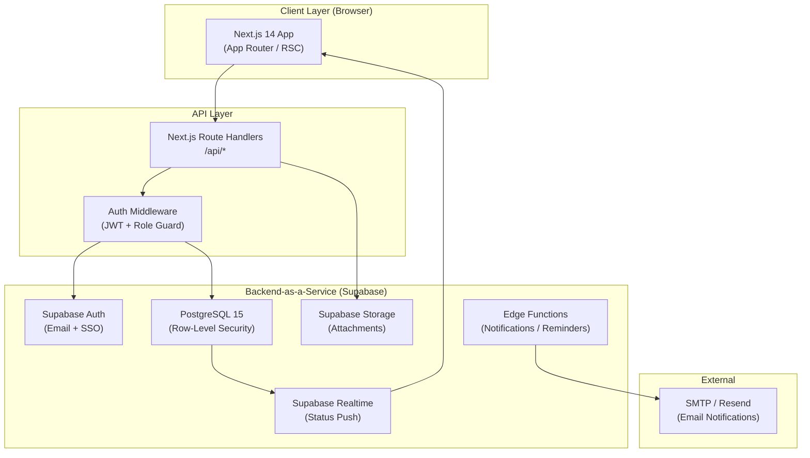
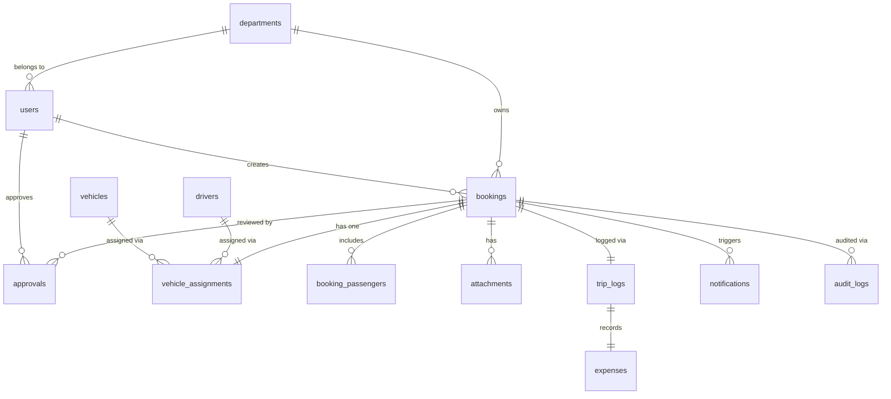
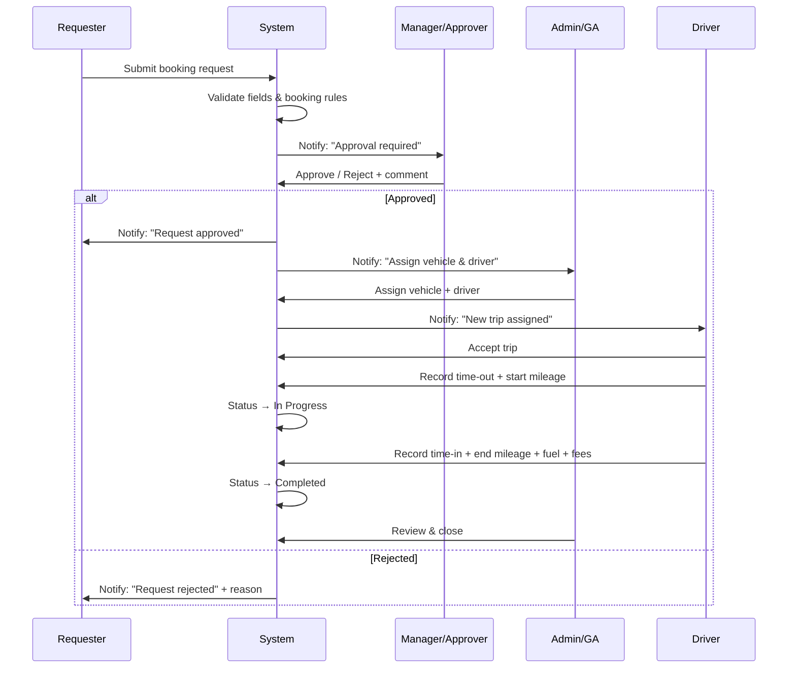
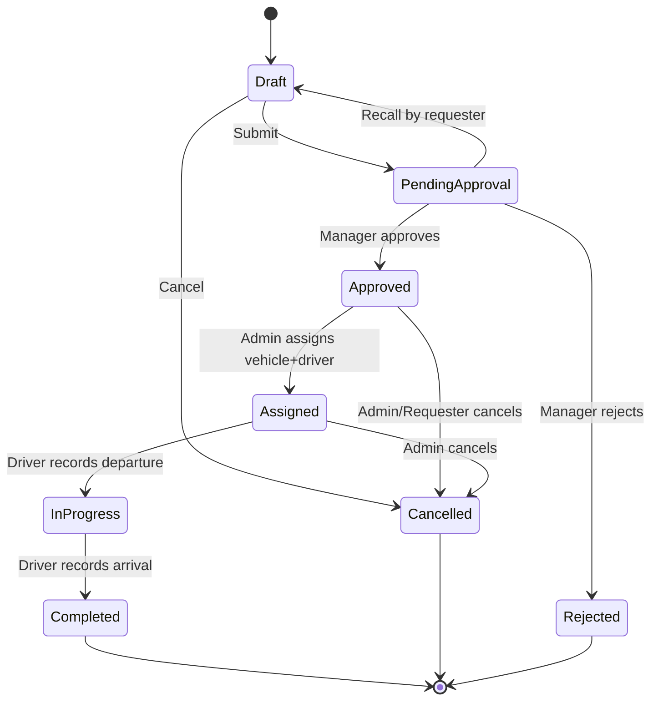

# Car Service Requisition System — Full System Design

> **System Name**: Car Service Requisition System (CSRS)
> **Purpose**: Replace paper-based vehicle booking workflow with a digital, role-aware, auditable platform.
> **Stack Recommendation**: Next.js 14 (App Router) + TypeScript · Supabase (PostgreSQL + Auth + Storage + Realtime) · Tailwind CSS · shadcn/ui · React Hook Form + Zod · TanStack Table · Recharts · ExcelJS / jsPDF

---

## 1. System Architecture



### Key Architectural Decisions

| Decision      | Choice                 | Rationale                                          |
| ------------- | ---------------------- | -------------------------------------------------- |
| Rendering     | SSR + RSC              | Fast initial load; secure server-side role checks  |
| Auth          | Supabase Auth (JWT)    | Built-in session, email magic link, future SSO     |
| DB Access     | Supabase client + RLS  | Security at DB layer; no data leakage across roles |
| File Storage  | Supabase Storage       | Signed URLs; integrates with DB policies           |
| Real-time     | Supabase Realtime      | Live status updates without polling                |
| Notifications | Edge Function + Resend | Decoupled, scalable                                |
| Reports       | ExcelJS + jsPDF        | Client-side generation; no server overhead         |

---

## 2. Database Schema

### 2.1 Entity Relationship Overview



### 2.2 Table Definitions

```sql
-- ============================================================
-- DEPARTMENTS
-- ============================================================
CREATE TABLE departments (
  id          UUID PRIMARY KEY DEFAULT gen_random_uuid(),
  name        TEXT NOT NULL,
  code        TEXT UNIQUE NOT NULL,
  manager_id  UUID REFERENCES users(id),
  is_active   BOOLEAN DEFAULT TRUE,
  created_at  TIMESTAMPTZ DEFAULT now(),
  updated_at  TIMESTAMPTZ DEFAULT now()
);

-- ============================================================
-- USERS
-- ============================================================
CREATE TABLE users (
  id              UUID PRIMARY KEY REFERENCES auth.users(id),
  employee_id     TEXT UNIQUE NOT NULL,
  full_name       TEXT NOT NULL,
  email           TEXT UNIQUE NOT NULL,
  phone           TEXT,
  department_id   UUID REFERENCES departments(id),
  role            TEXT CHECK (role IN ('requester','approver','admin','driver')) NOT NULL,
  is_active       BOOLEAN DEFAULT TRUE,
  avatar_url      TEXT,
  created_at      TIMESTAMPTZ DEFAULT now(),
  updated_at      TIMESTAMPTZ DEFAULT now()
);

-- ============================================================
-- VEHICLES
-- ============================================================
CREATE TABLE vehicles (
  id              UUID PRIMARY KEY DEFAULT gen_random_uuid(),
  license_plate   TEXT UNIQUE NOT NULL,
  brand           TEXT NOT NULL,
  model           TEXT NOT NULL,
  vehicle_type    TEXT CHECK (vehicle_type IN ('van','car','pickup','other')) NOT NULL,
  capacity        INTEGER NOT NULL DEFAULT 7,
  gasoline_card   TEXT,
  color           TEXT,
  year            INTEGER,
  is_active       BOOLEAN DEFAULT TRUE,
  notes           TEXT,
  created_at      TIMESTAMPTZ DEFAULT now(),
  updated_at      TIMESTAMPTZ DEFAULT now()
);

-- ============================================================
-- DRIVERS
-- ============================================================
CREATE TABLE drivers (
  id              UUID PRIMARY KEY DEFAULT gen_random_uuid(),
  user_id         UUID REFERENCES users(id),          -- if driver is also a system user
  full_name       TEXT NOT NULL,
  employee_id     TEXT UNIQUE,
  phone           TEXT NOT NULL,
  license_number  TEXT NOT NULL,
  license_expiry  DATE NOT NULL,
  is_active       BOOLEAN DEFAULT TRUE,
  notes           TEXT,
  created_at      TIMESTAMPTZ DEFAULT now(),
  updated_at      TIMESTAMPTZ DEFAULT now()
);

-- ============================================================
-- BOOKINGS (core table)
-- ============================================================
CREATE TABLE bookings (
  id                    UUID PRIMARY KEY DEFAULT gen_random_uuid(),
  booking_no            TEXT UNIQUE NOT NULL,          -- e.g. CSR-2025-001234
  requester_id          UUID NOT NULL REFERENCES users(id),
  department_id         UUID NOT NULL REFERENCES departments(id),
  status                TEXT CHECK (status IN (
                          'draft','pending_approval','approved','rejected',
                          'assigned','in_progress','completed','cancelled'
                        )) DEFAULT 'draft',

  -- Booking category
  category              TEXT CHECK (category IN (
                          'business_trip','after_hours','errand',
                          'overtime_transport','visitor_pickup'
                        )) NOT NULL,

  -- Schedule
  using_date            DATE NOT NULL,
  start_time            TIME NOT NULL,
  end_time              TIME NOT NULL,

  -- Locations
  pickup_location       TEXT NOT NULL,
  destination           TEXT NOT NULL,
  stops                 JSONB DEFAULT '[]',             -- [{order,address,note}]

  -- Purpose & passengers
  purpose               TEXT NOT NULL,
  num_passengers        INTEGER NOT NULL DEFAULT 1,
  meeting_point         TEXT CHECK (meeting_point IN ('front_area','loading_area')),

  -- Flags
  with_staff            BOOLEAN DEFAULT FALSE,
  driver_required       BOOLEAN DEFAULT TRUE,
  after_hours           BOOLEAN DEFAULT FALSE,
  overtime_transport    BOOLEAN DEFAULT FALSE,
  urgent                BOOLEAN DEFAULT FALSE,
  urgent_reason         TEXT,

  -- Vehicle preference
  vehicle_type_pref     TEXT CHECK (vehicle_type_pref IN ('van','car','pickup','other','any')) DEFAULT 'any',

  -- Cancellation
  cancel_reason         TEXT,
  cancelled_at          TIMESTAMPTZ,
  cancelled_by          UUID REFERENCES users(id),

  -- Rejection
  reject_reason         TEXT,
  rejected_at           TIMESTAMPTZ,
  rejected_by           UUID REFERENCES users(id),

  created_at            TIMESTAMPTZ DEFAULT now(),
  updated_at            TIMESTAMPTZ DEFAULT now()
);

-- ============================================================
-- BOOKING PASSENGERS
-- ============================================================
CREATE TABLE booking_passengers (
  id          UUID PRIMARY KEY DEFAULT gen_random_uuid(),
  booking_id  UUID NOT NULL REFERENCES bookings(id) ON DELETE CASCADE,
  name        TEXT NOT NULL,
  employee_id TEXT,
  department  TEXT,
  phone       TEXT,
  seq         INTEGER DEFAULT 0
);

-- ============================================================
-- APPROVALS
-- ============================================================
CREATE TABLE approvals (
  id            UUID PRIMARY KEY DEFAULT gen_random_uuid(),
  booking_id    UUID NOT NULL REFERENCES bookings(id) ON DELETE CASCADE,
  approver_id   UUID NOT NULL REFERENCES users(id),
  action        TEXT CHECK (action IN ('approved','rejected','delegated')) NOT NULL,
  comments      TEXT,
  acted_at      TIMESTAMPTZ DEFAULT now()
);

-- ============================================================
-- VEHICLE ASSIGNMENTS
-- ============================================================
CREATE TABLE vehicle_assignments (
  id              UUID PRIMARY KEY DEFAULT gen_random_uuid(),
  booking_id      UUID UNIQUE NOT NULL REFERENCES bookings(id) ON DELETE CASCADE,
  vehicle_id      UUID NOT NULL REFERENCES vehicles(id),
  driver_id       UUID NOT NULL REFERENCES drivers(id),
  assigned_by     UUID NOT NULL REFERENCES users(id),
  driver_accepted BOOLEAN,
  driver_accepted_at TIMESTAMPTZ,
  gasoline_card   TEXT,
  notes           TEXT,
  assigned_at     TIMESTAMPTZ DEFAULT now()
);

-- ============================================================
-- TRIP LOGS (driver records)
-- ============================================================
CREATE TABLE trip_logs (
  id                UUID PRIMARY KEY DEFAULT gen_random_uuid(),
  booking_id        UUID UNIQUE NOT NULL REFERENCES bookings(id) ON DELETE CASCADE,
  actual_time_out   TIMESTAMPTZ,
  actual_time_in    TIMESTAMPTZ,
  start_mileage     NUMERIC(10,1),
  end_mileage       NUMERIC(10,1),
  total_km          NUMERIC(10,1) GENERATED ALWAYS AS (end_mileage - start_mileage) STORED,
  fuel_liters       NUMERIC(6,2),
  remarks           TEXT,
  recorded_by       UUID REFERENCES users(id),
  updated_at        TIMESTAMPTZ DEFAULT now()
);

-- ============================================================
-- EXPENSES
-- ============================================================
CREATE TABLE expenses (
  id          UUID PRIMARY KEY DEFAULT gen_random_uuid(),
  booking_id  UUID NOT NULL REFERENCES bookings(id) ON DELETE CASCADE,
  fuel_cost   NUMERIC(10,2) DEFAULT 0,
  toll_fee    NUMERIC(10,2) DEFAULT 0,
  parking_fee NUMERIC(10,2) DEFAULT 0,
  other_cost  NUMERIC(10,2) DEFAULT 0,
  total_cost  NUMERIC(10,2) GENERATED ALWAYS AS (fuel_cost + toll_fee + parking_fee + other_cost) STORED,
  currency    TEXT DEFAULT 'THB',
  updated_at  TIMESTAMPTZ DEFAULT now()
);

-- ============================================================
-- ATTACHMENTS
-- ============================================================
CREATE TABLE attachments (
  id          UUID PRIMARY KEY DEFAULT gen_random_uuid(),
  booking_id  UUID NOT NULL REFERENCES bookings(id) ON DELETE CASCADE,
  file_name   TEXT NOT NULL,
  file_type   TEXT,
  file_size   INTEGER,
  storage_key TEXT NOT NULL,               -- Supabase Storage path
  uploaded_by UUID REFERENCES users(id),
  uploaded_at TIMESTAMPTZ DEFAULT now()
);

-- ============================================================
-- NOTIFICATIONS
-- ============================================================
CREATE TABLE notifications (
  id          UUID PRIMARY KEY DEFAULT gen_random_uuid(),
  user_id     UUID NOT NULL REFERENCES users(id),
  booking_id  UUID REFERENCES bookings(id),
  type        TEXT NOT NULL,              -- 'approval_required','status_changed', etc.
  title       TEXT NOT NULL,
  body        TEXT,
  is_read     BOOLEAN DEFAULT FALSE,
  created_at  TIMESTAMPTZ DEFAULT now()
);

-- ============================================================
-- AUDIT LOGS
-- ============================================================
CREATE TABLE audit_logs (
  id          UUID PRIMARY KEY DEFAULT gen_random_uuid(),
  booking_id  UUID REFERENCES bookings(id),
  actor_id    UUID REFERENCES users(id),
  action      TEXT NOT NULL,
  old_data    JSONB,
  new_data    JSONB,
  ip_address  TEXT,
  user_agent  TEXT,
  created_at  TIMESTAMPTZ DEFAULT now()
);

-- ============================================================
-- USEFUL INDEXES
-- ============================================================
CREATE INDEX idx_bookings_status         ON bookings(status);
CREATE INDEX idx_bookings_using_date     ON bookings(using_date);
CREATE INDEX idx_bookings_requester      ON bookings(requester_id);
CREATE INDEX idx_bookings_department     ON bookings(department_id);
CREATE INDEX idx_vehicle_assignments_vid ON vehicle_assignments(vehicle_id);
CREATE INDEX idx_vehicle_assignments_did ON vehicle_assignments(driver_id);
CREATE INDEX idx_notifications_user      ON notifications(user_id, is_read);
```

### 2.3 Double-Booking Prevention (DB Constraint)

```sql
-- Prevent same vehicle being assigned to overlapping trips
CREATE OR REPLACE FUNCTION check_vehicle_overlap()
RETURNS TRIGGER LANGUAGE plpgsql AS $$
DECLARE
  conflict_count INTEGER;
BEGIN
  SELECT COUNT(*) INTO conflict_count
  FROM vehicle_assignments va
  JOIN bookings b ON b.id = va.booking_id
  WHERE va.vehicle_id = NEW.vehicle_id
    AND va.booking_id <> NEW.booking_id
    AND b.status NOT IN ('cancelled','rejected','completed')
    AND (
      (b.using_date, b.start_time, b.end_time) OVERLAPS
      ((SELECT using_date FROM bookings WHERE id = NEW.booking_id),
       (SELECT start_time FROM bookings WHERE id = NEW.booking_id),
       (SELECT end_time   FROM bookings WHERE id = NEW.booking_id))
    );
  IF conflict_count > 0 THEN
    RAISE EXCEPTION 'Vehicle is already assigned to an overlapping trip.';
  END IF;
  RETURN NEW;
END;
$$;

CREATE TRIGGER trg_vehicle_overlap
BEFORE INSERT OR UPDATE ON vehicle_assignments
FOR EACH ROW EXECUTE FUNCTION check_vehicle_overlap();
```

---

## 3. User Flow



### 3.1 Status Transition Map



---

## 4. Page Structure

```
/                         → Redirect to /dashboard or /login
/login                    → Login page
/dashboard                → Role-aware home (Requester / Approver / Admin / Driver)

── REQUESTER ──────────────────────────────────────────────────
/bookings/new             → Create booking request
/bookings/[id]            → Booking detail (view/edit/cancel)
/bookings                 → My bookings list

── APPROVER ───────────────────────────────────────────────────
/approvals                → Approval queue
/approvals/[id]           → Booking detail + approve/reject panel

── ADMIN / GA ─────────────────────────────────────────────────
/admin/bookings           → All bookings table (filterable, sortable)
/admin/calendar           → Booking calendar (month/week/day)
/admin/bookings/[id]      → Booking detail + assignment panel
/admin/vehicles           → Vehicle management CRUD
/admin/drivers            → Driver management CRUD
/admin/users              → User & department management
/admin/reports            → Reports dashboard

── DRIVER ─────────────────────────────────────────────────────
/driver/trips             → Assigned trips list
/driver/trips/[id]        → Trip detail + accept + record completion

── SHARED ─────────────────────────────────────────────────────
/notifications            → Notification centre
/profile                  → Profile settings
```

### 4.1 Page-by-Page Layout Notes

| Page             | Key Components                                                               |
| ---------------- | ---------------------------------------------------------------------------- |
| Login            | Company logo, email+password, magic link option, error toast                 |
| Dashboard        | KPI cards, quick action buttons, recent activity feed, upcoming trips        |
| Create Booking   | Multi-step form wizard (5 steps), real-time validation, progress bar         |
| Booking Detail   | Status timeline, info sections, action buttons per role                      |
| Approval Queue   | Filterable table, inline approve/reject with comment, bulk actions           |
| Admin Calendar   | FullCalendar-style month/week view, color-coded by status, click-to-open     |
| Admin Table      | TanStack Table, filters, sort, export, pagination                            |
| Assignment Panel | Dropdown for vehicle+driver, conflict warning badge, live availability check |
| Vehicle Mgmt     | Table + modal form, photo upload, status toggle                              |
| Driver Mgmt      | Table + modal form, license expiry alert                                     |
| Driver Trip List | Cards grouped by date, status badge, accept button                           |
| Trip Completion  | Form with mileage inputs, time pickers, expense fields                       |
| Reports          | Date range filter, chart tabs, download buttons                              |

---

## 5. API Endpoint Design

All endpoints are prefixed with `/api/v1`. Auth via `Authorization: Bearer <jwt>`.

### 5.1 Authentication

| Method | Endpoint       | Description            |
| ------ | -------------- | ---------------------- |
| POST   | `/auth/login`  | Email + password login |
| POST   | `/auth/logout` | Invalidate session     |
| GET    | `/auth/me`     | Current user profile   |
| PUT    | `/auth/me`     | Update profile         |

### 5.2 Bookings

| Method | Endpoint                | Description                      | Roles                  |
| ------ | ----------------------- | -------------------------------- | ---------------------- |
| GET    | `/bookings`             | List bookings (filtered by role) | All                    |
| POST   | `/bookings`             | Create booking                   | Requester              |
| GET    | `/bookings/:id`         | Get booking detail               | Owner, Approver, Admin |
| PUT    | `/bookings/:id`         | Update booking (draft only)      | Requester              |
| DELETE | `/bookings/:id`         | Cancel booking                   | Requester, Admin       |
| POST   | `/bookings/:id/submit`  | Submit draft for approval        | Requester              |
| POST   | `/bookings/:id/recall`  | Recall pending request           | Requester              |
| GET    | `/bookings/:id/history` | Audit trail                      | Admin                  |

### 5.3 Approvals

| Method | Endpoint                         | Description                        | Roles    |
| ------ | -------------------------------- | ---------------------------------- | -------- |
| GET    | `/approvals`                     | List pending approvals for manager | Approver |
| POST   | `/approvals/:booking_id/approve` | Approve request                    | Approver |
| POST   | `/approvals/:booking_id/reject`  | Reject with reason                 | Approver |

### 5.4 Assignments

| Method | Endpoint                    | Description                   | Roles  |
| ------ | --------------------------- | ----------------------------- | ------ |
| POST   | `/assignments`              | Assign vehicle + driver       | Admin  |
| PUT    | `/assignments/:id`          | Update assignment             | Admin  |
| GET    | `/assignments/availability` | Vehicle & driver availability | Admin  |
| POST   | `/assignments/:id/accept`   | Driver accepts trip           | Driver |

### 5.5 Trip Logs

| Method | Endpoint                      | Description                 | Roles         |
| ------ | ----------------------------- | --------------------------- | ------------- |
| PUT    | `/trips/:booking_id/start`    | Record departure            | Driver        |
| PUT    | `/trips/:booking_id/complete` | Record completion + mileage | Driver        |
| GET    | `/trips/:booking_id`          | Get trip log                | Admin, Driver |

### 5.6 Vehicle & Driver Management

| Method         | Endpoint        | Description            | Roles |
| -------------- | --------------- | ---------------------- | ----- |
| GET/POST       | `/vehicles`     | List / create vehicles | Admin |
| GET/PUT/DELETE | `/vehicles/:id` | Vehicle detail ops     | Admin |
| GET/POST       | `/drivers`      | List / create drivers  | Admin |
| GET/PUT/DELETE | `/drivers/:id`  | Driver detail ops      | Admin |

### 5.7 Users & Departments

| Method   | Endpoint       | Description         | Roles |
| -------- | -------------- | ------------------- | ----- |
| GET/POST | `/users`       | List / create users | Admin |
| PUT      | `/users/:id`   | Update user / role  | Admin |
| GET/POST | `/departments` | Dept management     | Admin |

### 5.8 Reports

| Method | Endpoint                   | Description           | Roles |
| ------ | -------------------------- | --------------------- | ----- |
| GET    | `/reports/monthly-usage`   | Monthly vehicle usage | Admin |
| GET    | `/reports/by-department`   | Usage by department   | Admin |
| GET    | `/reports/after-hours`     | After-hours usage     | Admin |
| GET    | `/reports/mileage`         | Mileage by vehicle    | Admin |
| GET    | `/reports/costs`           | Cost summary          | Admin |
| GET    | `/reports/driver-workload` | Driver trip counts    | Admin |
| GET    | `/reports/export`          | Export Excel/PDF      | Admin |

### 5.9 Notifications

| Method | Endpoint                  | Description             | Roles |
| ------ | ------------------------- | ----------------------- | ----- |
| GET    | `/notifications`          | List user notifications | All   |
| PUT    | `/notifications/:id/read` | Mark as read            | All   |
| PUT    | `/notifications/read-all` | Mark all read           | All   |

---

## 6. Role-Based Permission Design

### 6.1 Permission Matrix

| Feature               |       Requester        | Approver  | Admin | Driver |
| --------------------- | :--------------------: | :-------: | :---: | :----: |
| Create booking        |           ✅           |    ✅     |  ✅   |   ❌   |
| View own bookings     |           ✅           |    ✅     |  ✅   |   ✅   |
| View all bookings     |           ❌           | Dept only |  ✅   |   ❌   |
| Edit draft booking    |         ✅ Own         |    ❌     |  ✅   |   ❌   |
| Cancel booking        | ✅ Own (draft/pending) |    ❌     |  ✅   |   ❌   |
| Approve / Reject      |           ❌           |  ✅ Dept  |  ✅   |   ❌   |
| Assign vehicle/driver |           ❌           |    ❌     |  ✅   |   ❌   |
| Accept trip           |           ❌           |    ❌     |  ❌   | ✅ Own |
| Record trip data      |           ❌           |    ❌     |  ✅   | ✅ Own |
| Manage vehicles       |           ❌           |    ❌     |  ✅   |   ❌   |
| Manage drivers        |           ❌           |    ❌     |  ✅   |   ❌   |
| Manage users          |           ❌           |    ❌     |  ✅   |   ❌   |
| View reports          |           ❌           | Dept only |  ✅   |   ❌   |
| Export data           |           ❌           |    ❌     |  ✅   |   ❌   |

### 6.2 Row-Level Security (Supabase RLS)

```sql
-- Requesters only see their own bookings
CREATE POLICY "requester_own_bookings" ON bookings
  FOR SELECT USING (
    auth.uid() = requester_id
    OR (SELECT role FROM users WHERE id = auth.uid()) IN ('admin','approver')
  );

-- Approvers see bookings from their department only
CREATE POLICY "approver_dept_bookings" ON bookings
  FOR SELECT USING (
    (SELECT role FROM users WHERE id = auth.uid()) = 'approver'
    AND department_id = (SELECT department_id FROM users WHERE id = auth.uid())
  );

-- Drivers see only their assigned trips
CREATE POLICY "driver_assigned_trips" ON vehicle_assignments
  FOR SELECT USING (
    driver_id IN (
      SELECT id FROM drivers WHERE user_id = auth.uid()
    )
    OR (SELECT role FROM users WHERE id = auth.uid()) = 'admin'
  );
```

---

## 7. Validation Rules

### 7.1 Booking Form Validation

| Field             | Rule                                                     |
| ----------------- | -------------------------------------------------------- |
| `using_date`      | Must be ≥ today + 1 working day (unless `urgent = true`) |
| `urgent_reason`   | Required when `urgent = true`                            |
| `end_time`        | Must be > `start_time`                                   |
| `num_passengers`  | Min 1; must not exceed vehicle capacity                  |
| `passenger_list`  | Required when `overtime_transport = true`                |
| `cancel_reason`   | Required on cancellation                                 |
| `start_mileage`   | Required on trip start                                   |
| `end_mileage`     | Required on completion; must be > `start_mileage`        |
| `actual_time_out` | Required on completion                                   |
| `actual_time_in`  | Required on completion; must be > `actual_time_out`      |
| `attachment`      | Max 10 MB per file; allowed: PDF, DOCX, JPG, PNG         |

### 7.2 Business Rules

```
RULE 1 – Advance Notice
  IF NOT urgent AND using_date <= today + 1 working_day
    THEN block submission with message "Please submit at least 1 working day in advance."

RULE 2 – Urgent Justification
  IF urgent = true AND urgent_reason IS NULL
    THEN block submission

RULE 3 – After-Hours Approval
  IF after_hours = true
    THEN route to manager approval (same flow, but flag clearly)

RULE 4 – Overtime Transport Passenger List
  IF overtime_transport = true AND (passenger_list IS EMPTY OR num_passengers < 1)
    THEN block submission

RULE 5 – Vehicle Double-Booking
  Enforce via DB trigger (see Section 2.3)
  Also enforce at API layer before DB insert

RULE 6 – Driver Overlap
  Same check as Rule 5 but scoped to driver_id in vehicle_assignments

RULE 7 – Cancellation Reason
  IF cancel_request AND cancel_reason IS NULL
    THEN block API call

RULE 8 – Trip Completion Integrity
  IF action = complete AND (start_mileage IS NULL OR end_mileage IS NULL
     OR actual_time_out IS NULL OR actual_time_in IS NULL)
    THEN block completion
```

### 7.3 Zod Schema Example (TypeScript)

```typescript
const bookingSchema = z
  .object({
    category: z.enum([
      "business_trip",
      "after_hours",
      "errand",
      "overtime_transport",
      "visitor_pickup",
    ]),
    using_date: z.string().refine((d) => isWorkingDayAhead(d, 1), {
      message: "Must be at least 1 working day in advance",
    }),
    start_time: z.string(),
    end_time: z.string(),
    pickup_location: z.string().min(3),
    destination: z.string().min(3),
    purpose: z.string().min(10),
    num_passengers: z.number().int().min(1).max(20),
    urgent: z.boolean(),
    urgent_reason: z.string().optional(),
    after_hours: z.boolean(),
    overtime_transport: z.boolean(),
    passenger_list: z.array(z.object({ name: z.string() })).optional(),
  })
  .superRefine((data, ctx) => {
    if (data.urgent && !data.urgent_reason) {
      ctx.addIssue({
        code: "custom",
        path: ["urgent_reason"],
        message: "Urgent reason is required",
      });
    }
    if (
      data.overtime_transport &&
      (!data.passenger_list || data.passenger_list.length === 0)
    ) {
      ctx.addIssue({
        code: "custom",
        path: ["passenger_list"],
        message: "Passenger list required for overtime transport",
      });
    }
    if (data.end_time <= data.start_time) {
      ctx.addIssue({
        code: "custom",
        path: ["end_time"],
        message: "End time must be after start time",
      });
    }
  });
```

---

## 8. UI/UX Layout Recommendations

### 8.1 Design System

```
Color Palette:
  Primary:    #2563EB  (Blue 600)
  Secondary:  #7C3AED  (Violet 600)
  Success:    #16A34A  (Green 600)
  Warning:    #D97706  (Amber 600)
  Danger:     #DC2626  (Red 600)
  Background: #F8FAFC  (Slate 50)
  Surface:    #FFFFFF
  Text:       #0F172A  (Slate 900)

Typography:
  Font Family: "Inter", sans-serif (via Google Fonts)
  Heading:     700 weight, tight tracking
  Body:        400/500 weight
  Caption:     400, muted slate

Spacing:      4px base unit (0.25rem)
Border Radius: 8px cards, 6px inputs, 4px badges
Shadow:       sm for cards, md for modals
```

### 8.2 Status Badge Color Mapping

| Status           | Color  |
| ---------------- | ------ |
| Draft            | Gray   |
| Pending Approval | Amber  |
| Approved         | Blue   |
| Rejected         | Red    |
| Assigned         | Violet |
| In Progress      | Indigo |
| Completed        | Green  |
| Cancelled        | Slate  |

### 8.3 Multi-Step Booking Form Wizard

```
Step 1: Basic Info      → Category, dates, times, location
Step 2: Trip Details    → Purpose, passengers, stops, meeting point
Step 3: Requirements    → Vehicle type, driver required, flags
Step 4: Passenger List  → (conditional: overtime_transport = true)
Step 5: Review & Submit → Summary card, attachment upload, submit button
```

### 8.4 Admin Calendar View

- Month view: dots colored by status on each day
- Week view: horizontal bars per booking (time-slot grid)
- Day view: detailed cards with vehicle + driver label
- Click any event → slide-over panel with booking detail
- Conflicts shown with red overlap indicator

### 8.5 Responsive Layout

```
Desktop (≥1280px):  Side nav (240px) + main content area
Tablet (768–1279px): Collapsible side nav + content
Mobile (<768px):     Bottom tab bar (Dashboard, Bookings, Notifications, Profile)
```

### 8.6 Notification UX

- Bell icon in top nav with unread badge count
- Dropdown panel with recent 5 notifications
- Full page at `/notifications`
- Email notification as backup for critical actions

---

## 9. MVP Development Plan

### Phase 0 — Project Setup (Week 1)

- [ ] Init Next.js 14 + TypeScript + Tailwind + shadcn/ui
- [ ] Configure Supabase project: Auth, DB, Storage, Realtime
- [ ] Apply full DB migration (schema from Section 2)
- [ ] Configure RLS policies
- [ ] Set up Resend for email notifications

### Phase 1 — Core Auth & Roles (Week 1–2)

- [ ] Login / logout page with Supabase Auth
- [ ] Middleware role guard for protected routes
- [ ] User profile page
- [ ] Seed initial admin + departments + test users

### Phase 2 — Booking Request Flow (Week 2–3)

- [ ] Create booking multi-step form with Zod validation
- [ ] Draft → Submit state machine
- [ ] Requester "My Bookings" list + detail page
- [ ] File attachment upload to Supabase Storage

### Phase 3 — Approval Flow (Week 3)

- [ ] Approver queue page
- [ ] Approve / reject with comment
- [ ] Email notification on status change

### Phase 4 — Admin Assignment (Week 4)

- [ ] Admin booking table with filters
- [ ] Vehicle + driver assignment panel
- [ ] Conflict detection at API + DB layer
- [ ] Admin booking calendar (month view)

### Phase 5 — Driver Flow (Week 4–5)

- [ ] Driver trip list page
- [ ] Accept trip
- [ ] Trip start: record time-out + start mileage
- [ ] Trip complete: record time-in + end mileage + expenses

### Phase 6 — Vehicle & Driver Management (Week 5)

- [ ] Vehicle CRUD page
- [ ] Driver CRUD page
- [ ] User & department management

### Phase 7 — Reports (Week 6)

- [ ] Reports dashboard with charts (Recharts)
- [ ] Excel export (ExcelJS)
- [ ] PDF export (jsPDF)

### Phase 8 — Polish & Testing (Week 6–7)

- [ ] Mobile responsive review
- [ ] Notification centre
- [ ] E2E tests (Playwright)
- [ ] Performance audit (Lighthouse)
- [ ] UAT with actual users

---

## 10. Future Enhancement Ideas

### Near-Term (3–6 months)

| Feature               | Description                                          |
| --------------------- | ---------------------------------------------------- |
| QR Code Check-in      | Driver scans QR at pickup to start trip              |
| GPS Route Logging     | Track actual route via browser Geolocation API       |
| Recurring Bookings    | Daily/weekly recurring trip templates                |
| Fuel Card Integration | Auto-sync fuel data from card provider API           |
| Mobile App (PWA)      | Install-to-homescreen PWA with offline draft support |

### Medium-Term (6–12 months)

| Feature                     | Description                                       |
| --------------------------- | ------------------------------------------------- |
| Approval Delegation         | Manager delegates approval to proxy when on leave |
| Cost Centre Allocation      | Split trip cost across multiple departments       |
| Vehicle Maintenance Tracker | Service records, next service mileage alerts      |
| Driver Rating System        | Requester rates driver after trip completion      |
| Predictive Availability     | AI suggests optimal vehicle based on history      |
| SSO / AD Integration        | Login via Microsoft Entra ID / Google Workspace   |

### Long-Term (12+ months)

| Feature                       | Description                                          |
| ----------------------------- | ---------------------------------------------------- |
| Fleet Analytics Dashboard     | ML-driven utilization and cost forecasting           |
| Carbon Footprint Tracking     | CO₂ emissions per trip based on mileage + fuel type  |
| Third-Party Fleet Integration | Connect to Grab for Business / AirAsia Ride overflow |
| Audit Compliance Reporting    | Export audit trail in ISO-compliant format           |
| Multi-Company / Multi-Site    | Support subsidiaries with separate vehicle pools     |

---

## Appendix — Booking Number Format

```
CSR-YYYY-NNNNNN
CSR       = Car Service Requisition
YYYY      = Year (e.g. 2025)
NNNNNN    = 6-digit sequence, reset yearly

Example: CSR-2025-000001
```

## Appendix — Notification Event Matrix

| Trigger Event                 | Notify                             |
| ----------------------------- | ---------------------------------- |
| Booking submitted             | Approver (email + in-app)          |
| Booking approved              | Requester (email + in-app)         |
| Booking rejected              | Requester (email + in-app)         |
| Vehicle + driver assigned     | Driver (email + in-app)            |
| Driver accepted trip          | Admin (in-app)                     |
| Trip started                  | Admin (in-app)                     |
| Trip completed                | Admin (email + in-app)             |
| Booking cancelled             | Approver + Admin (in-app)          |
| Urgent request submitted      | Approver (email + in-app, flagged) |
| Driver license expiring (30d) | Admin (email + in-app)             |
